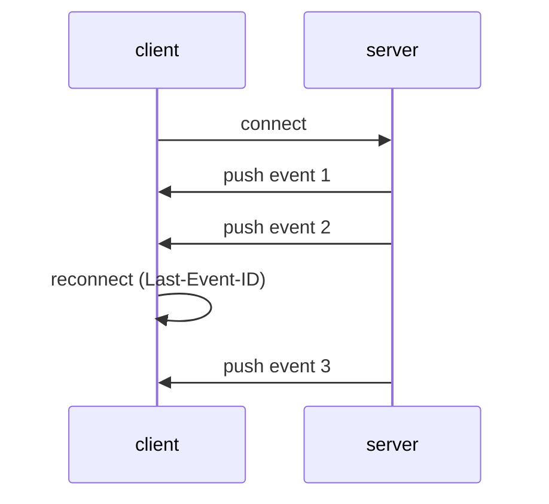

## What is Server-sent Events
- Server-Sent Events is a server push technology enabling a client to receive automatic updates from a server via an HTTP connection
- Its functionality is similar to WebSocket, but SSE is one-sided: it only sends data from the server to the client.

## How SSE works


**1. Client Request:**
- Client initiates a request to the server
- Just like any normal HTTP request. However, in the case of SSE, the client adds an additional header called `Accept: text/event-stream` to indicate that it wants to receive server-sent events.

**2. Server Response:** 
- Server sends back an HTTP response with the `Content-Type: text/event-stream` header to indicate that it will be sending a stream of events.

**3. Event Stream:**
- Once the connection is established, the server starts sending events to the client over a single, long-lived HTTP response. 
  - Each event is formatted as a plain text string and consists of one or more fields separated by newline characters.
  - id: Event ID. When the client reconnects, it will pass the last event ID to the server via the header `Last-Event-ID`
  - event: event name, it will be used in `eventSource.addEventListener('{event name}', (event)=>{...})`
  - data: The data field for the message. Server may write multiple lines by ending each line with `\n` and the last line by `\n\n`
  - retry: The reconnection time. If the connection to the server is lost, the browser will wait for the specified time before attempting to reconnect
  - Sample:
    ```yaml
    id: this is event id \n
    retry: 3000 \n
    data: line 1 content \n
    data: last line content \n\n
    ```
**4. Client Handling:** 
- Client define the `EventSource`
  ```javascript
      const source = new EventSource("http://localhost:9000/users/count")
  ```
- Add event listener for the specific event name:
  ```javascript
    source.addEventListener("userCount", (event) => {
        console.log(event)
        document.querySelector("#users").innerHTML = event.data
    })
  ```

- If event name is not set, event can be handled by `source.onMessage`
  ```javascript
  source.onmessage = (event) => {
        console.log(event)
        document.querySelector("#users").innerHTML = event.data
  }
  ```


## Applications
SSE is useful for scenarios where the data stream flows in one direction: Server to Client

_**For examples:**_
- Price chart
- Realtime users
- Pub-sub pattern
- Social media updates: When you see new posts appear on your social media feed without manually refreshing the page, that's SSE in action

## Referents
- https://developer.mozilla.org/en-US/docs/Web/API/Server-sent_events/Using_server-sent_events